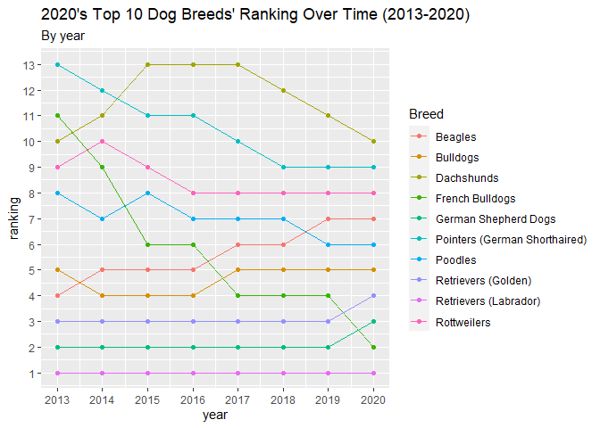
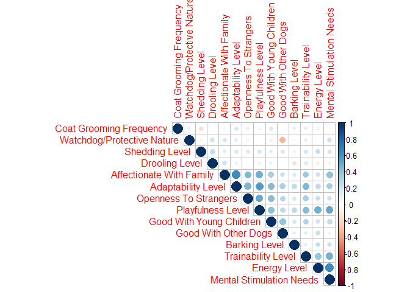

Dog Breeds
================
Fanyi Zeng
3/16/2022

The data comes from the American Kennel Club. source:
<https://github.com/rfordatascience/tidytuesday/blob/master/data/2022/2022-02-01/readme.md>

breed_traits - trait information on each dog breed and scores for each
trait (wide format)

trait_description - long descriptions of each trait and values
corresponding to Trait_Score

breed_rank_all - popularity of dog breeds by AKC registration statistics
from 2013-2020

``` r
library(tidyverse)
library(tidymodels)
library(dsbox)
library("Hmisc")
```

    ## Warning: package 'Hmisc' was built under R version 4.1.3

``` r
library(corrplot)
```

    ## Warning: package 'corrplot' was built under R version 4.1.3

``` r
breed_traits <- readr::read_csv('https://raw.githubusercontent.com/rfordatascience/tidytuesday/master/data/2022/2022-02-01/breed_traits.csv')
trait_description <- readr::read_csv('https://raw.githubusercontent.com/rfordatascience/tidytuesday/master/data/2022/2022-02-01/trait_description.csv')
breed_rank_all <- readr::read_csv('https://raw.githubusercontent.com/rfordatascience/tidytuesday/master/data/2022/2022-02-01/breed_rank.csv')
```

### Breed Ranking

Let’s take a look at the breed ranking dataset. It shows the ranking of
195 dog breeds across 8 years (2013-2020).

``` r
breed_rank_all
```

    ## # A tibble: 195 x 11
    ##    Breed `2013 Rank` `2014 Rank` `2015 Rank` `2016 Rank` `2017 Rank` `2018 Rank`
    ##    <chr>       <dbl>       <dbl>       <dbl>       <dbl>       <dbl>       <dbl>
    ##  1 Retr~           1           1           1           1           1           1
    ##  2 Fren~          11           9           6           6           4           4
    ##  3 Germ~           2           2           2           2           2           2
    ##  4 Retr~           3           3           3           3           3           3
    ##  5 Bull~           5           4           4           4           5           5
    ##  6 Pood~           8           7           8           7           7           7
    ##  7 Beag~           4           5           5           5           6           6
    ##  8 Rott~           9          10           9           8           8           8
    ##  9 Poin~          13          12          11          11          10           9
    ## 10 Dach~          10          11          13          13          13          12
    ## # ... with 185 more rows, and 4 more variables: 2019 Rank <dbl>,
    ## #   2020 Rank <dbl>, links <chr>, Image <chr>

First, I convert the data format from wide to long, in order to
visualize the data.

``` r
rank_long <- breed_rank_all %>%
  select(-links, -Image) %>%
  pivot_longer(-Breed, "year") %>%
  mutate(value = as.numeric(value))
```

It is important to convert the year into numeric values.

``` r
rank_long <- rank_long %>%
  mutate(year = str_remove(year, " Rank")) %>%
  mutate(year = as.numeric(year))
```

I am interested in how the 2020’s top 10 dogs perform across years, so I
only keep the top 10 dogs in the original breed ranking dataset.

``` r
top10in2020 <- rank_long %>%
  filter(year==2020 & value <= 10 & value >=1)
top10 <- semi_join(rank_long, top10in2020, "Breed")
```

Now we can visualize the ranking data.

``` r
top10 %>%
  ggplot(aes(x=year, y=value, group=Breed, color=Breed)) +
  geom_point() +
  geom_line() +
  scale_x_continuous(breaks=seq(2013,2020,1)) +
  scale_y_continuous(breaks=seq(1,13,1)) +
  labs(title="2020's Top 10 Dog Breeds' Ranking Over Time (2013-2020)", subtitle="By year", y="ranking")
```

<!-- -->

We can see that Labrador Retrievers have been ranked #1 for 8 years.
Similarly, German shepherd dogs, Golden Retrievers, and bulldogs have
always been relatively popular. While Beagles have decreased in ranking,
poodles and pointers have gained popularity over the years. As the “dark
horses”, French bulldogs have gone through a spike in ranking, from #11
in 2013 to #2 in 2020. Dachshunds have experienced a decrease then an
increase in ranking, resulting in the same ranking in 2020 as in 2013.

### Breed Traits

Now let’s take a look at the breed traits dataset.

``` r
colnames(breed_traits)
```

    ##  [1] "Breed"                      "Affectionate With Family"  
    ##  [3] "Good With Young Children"   "Good With Other Dogs"      
    ##  [5] "Shedding Level"             "Coat Grooming Frequency"   
    ##  [7] "Drooling Level"             "Coat Type"                 
    ##  [9] "Coat Length"                "Openness To Strangers"     
    ## [11] "Playfulness Level"          "Watchdog/Protective Nature"
    ## [13] "Adaptability Level"         "Trainability Level"        
    ## [15] "Energy Level"               "Barking Level"             
    ## [17] "Mental Stimulation Needs"

I am curious about the relationships among the traits, so I run
correlations between every two traits. I have taken out breed name,
because it is irrelevant, as well as coat type and coat length, because
they are string variables. The codes below returns a r value matrix and
a p value matrix.

``` r
cor<-rcorr(as.matrix(breed_traits[,c(-1,-8,-9)]))
```

The number of variables and matrices makes the results hard to read, so
I decide to visualize the results with a colored plot. The larger a
correlation, the larger its circle, and the deeper the color of its
circle. Blue indicates a positive correlation, and red indicates a
negative correlation. Insignificant correlations are left blank.

``` r
corrplot(cor$r, type="upper", order="hclust", 
         p.mat = cor$p, sig.level = 0.05, insig = "blank")
```

<!-- -->

We can see some strong correlations around the middle and at the bottom.
It seems that affectionate with family, adaptability, open to strangers,
playfulness, and trainability are strongly correlated with one another,
and these four variables are moderately to weakly correlated with good
with children, good with other dogs, and barking level.

Playfulness (enthusiam level even past the puppy years) are highly
correlated with trainability (willingness to learn new things), good
with young children, energy level, and mental stimulation.

For some reason, drooling level is negatively correlated with barking
level and energy level. Breeds that drool a lot don’t like to bark or
exercise as often.

Watchdog/protective nature is negatively correlated with good with other
dogs. “Watchdog” breeds are alert to the surrounding environment and
potential threats, and they tend not be welcoming to other dogs, young
children, or strangers. These breeds also drool relatively more and
require more mental stimulation.

Strangely, shedding level (how much hair they shed) and coat grooming
frequency (how much grooming is required) are negatively correlated,
which does not make much sense to me. According to the definition of the
shedding level variable, high shedding breeds require more grooming.

In summary, there are roughly several “groups” of dog breeds: (the first
type and the second type are highly correlated, in fact)

1.  the affectionate type, who are very lovey-dovey towards family and
    everyone they know well; they are adaptable to changing living
    environment; they are friendly to strangers and other dogs. They are
    everyone’s best buddies.

2.  the playful type, who like to play a lot, learn new tricks, be
    around young children, and need a lot of physical as well as mental
    exercise on a daily basis. They are bundles of energy.

3.  the watchdog type, who are more cautious about the environment, more
    wary of other dogs and strangers, less patient around young
    children, drool more, and require more mental stimulation. They are
    loyal guard dogs.

### Ranking and Traits

Lastly, I would like to examine the relationship between 2020 ranking
and traits. The breed traits dataset is already organized in the order
of 2020 breed ranking, so I just need to add the 2020 ranking column at
the end of the breed traits dataset.

``` r
breed_traits <- breed_traits %>%
  mutate(ranking = breed_rank_all$`2020 Rank`)
```

Then I run a multiple linear regression. It seems that the breed traits
explain about 18% variance in 2020’s breed ranking. Among them,
playfulness, watchdog nature, and barking level are significant
predictors, and affectionate with family and drooling level are
marginally significant.

``` r
m_rank <- lm(ranking ~., data = breed_traits[,c(-1,-8,-9)])
summary(m_rank)
```

    ## 
    ## Call:
    ## lm(formula = ranking ~ ., data = breed_traits[, c(-1, -8, -9)])
    ## 
    ## Residuals:
    ##      Min       1Q   Median       3Q      Max 
    ## -112.722  -42.640    5.815   36.730  112.212 
    ## 
    ## Coefficients:
    ##                              Estimate Std. Error t value Pr(>|t|)    
    ## (Intercept)                  236.8429    30.9791   7.645  1.2e-12 ***
    ## `Affectionate With Family`    11.5092     5.9725   1.927 0.055548 .  
    ## `Good With Young Children`    -4.8693     4.4389  -1.097 0.274122    
    ## `Good With Other Dogs`         1.2710     4.6925   0.271 0.786810    
    ## `Shedding Level`              -7.0728     4.7363  -1.493 0.137100    
    ## `Coat Grooming Frequency`     -7.2010     4.1677  -1.728 0.085739 .  
    ## `Drooling Level`              -8.3058     4.4086  -1.884 0.061179 .  
    ## `Openness To Strangers`       -6.7875     5.1290  -1.323 0.187393    
    ## `Playfulness Level`          -27.0631     7.4481  -3.634 0.000364 ***
    ## `Watchdog/Protective Nature`  -9.3769     4.5283  -2.071 0.039809 *  
    ## `Adaptability Level`          -1.9364     8.2068  -0.236 0.813744    
    ## `Trainability Level`           1.1707     5.1311   0.228 0.819788    
    ## `Energy Level`                 0.1313     6.5865   0.020 0.984120    
    ## `Barking Level`                8.5921     3.5733   2.405 0.017207 *  
    ## `Mental Stimulation Needs`     1.5712     7.5237   0.209 0.834818    
    ## ---
    ## Signif. codes:  0 '***' 0.001 '**' 0.01 '*' 0.05 '.' 0.1 ' ' 1
    ## 
    ## Residual standard error: 51.15 on 180 degrees of freedom
    ## Multiple R-squared:  0.2378, Adjusted R-squared:  0.1785 
    ## F-statistic: 4.011 on 14 and 180 DF,  p-value: 5.117e-06

By including playfulness, watchdog nature, and barking level,
affectionate with family, and drooling level in the new model,
affectionate with family becomes non-significant at .09. So I further
remove affectionate with family, and the other four variables are
significant.

Playfulness is the most significant predictor of ranking. Since
playfulness is positively correlated with barking level, the latter
becomes significant too. Playfulness is also very strongly correlated
with other good characteristics such as affectionate with family, good
with other dogs, good with children, etc., so it makes sense that
playful dogs are popular.

It is interesting that drooling level is significant, and it seems to be
more significant than watchdog nature, which it is positively correlated
with. There might be some characteristics that people value in dogs that
happen to drool a lot.

``` r
m_rank2 <- lm(ranking ~., data = breed_traits[,c(7,11,12,16,18)])
summary(m_rank2)
```

    ## 
    ## Call:
    ## lm(formula = ranking ~ ., data = breed_traits[, c(7, 11, 12, 
    ##     16, 18)])
    ## 
    ## Residuals:
    ##      Min       1Q   Median       3Q      Max 
    ## -107.748  -41.705    1.975   38.973  128.575 
    ## 
    ## Coefficients:
    ##                              Estimate Std. Error t value Pr(>|t|)    
    ## (Intercept)                   223.862     24.529   9.126  < 2e-16 ***
    ## `Drooling Level`               -8.830      3.997  -2.209   0.0284 *  
    ## `Playfulness Level`           -28.628      5.171  -5.536 1.02e-07 ***
    ## `Watchdog/Protective Nature`   -7.770      3.971  -1.956   0.0519 .  
    ## `Barking Level`                 7.303      3.489   2.093   0.0377 *  
    ## ---
    ## Signif. codes:  0 '***' 0.001 '**' 0.01 '*' 0.05 '.' 0.1 ' ' 1
    ## 
    ## Residual standard error: 51.6 on 190 degrees of freedom
    ## Multiple R-squared:  0.1814, Adjusted R-squared:  0.1642 
    ## F-statistic: 10.53 on 4 and 190 DF,  p-value: 1.007e-07

This is the most interesting dataset I have analyzed so far!
